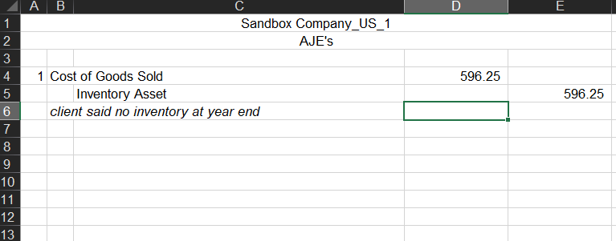
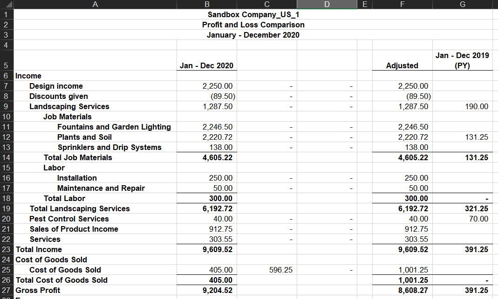
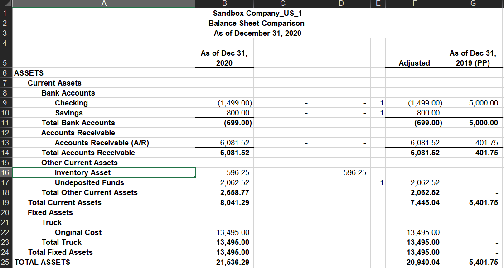

# Excel QuickBooks Working Paper

An Excel add-in for making AJE's to exported QuickBooks financials.

## Features
- AJE's made automatically flow through to Balance Sheet and Income Statement.
- Amounts in column F can be subtotaled at the end of the column.
  - Subtotal is determined by the entries in column E.
  - Can also copy the subtotal formulas to column G if needed.
- When sending adjustments back to client, account names will match their financials.

## How to Use
- ### QuickBooks Desktop
  - Run 'Profit and Loss Standard' report & select option to compare with prior year.
  - Export to Excel
    - Create new worksheet in new workbook
    - Go to advanced options and only select Row Height, AutoFit, Show Gridlines, and on printed report only
  - Run 'Balance Sheet Standard' report & select option to compare with prior year.
  - Export to Excel
    - Create new worksheet in existing workbook & select the workbook created for the P&L report.
  - Navigate to the 'Add-Ins' tab in Excel and select the 'QB Desktop Workpaper' button.
- ### QuickBooks Online
  - Run 'Profit and Loss Comparison' report
  - Export the report to Excel
  - Run 'Balance Sheet Comparison' report
  - Export the report to Excel
  - Combine the two sheets into one [workbook](sample-files/qb-online-before.xlsx). Sheet order does not matter.
  - Navigate to the 'Add-Ins' tab in Excel and select the 'QB Online Workpaper' button.

## Setup
- Copy Add-in.xlam to your AppData\Microsoft\Excel\XLSTART folder